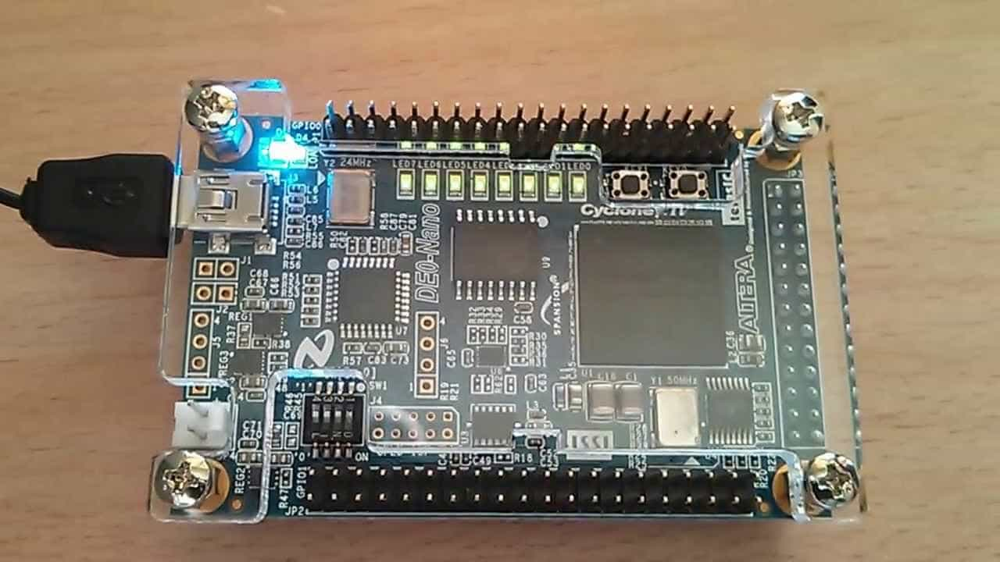

# Complementary Formation Activity micro controller design in VHDL

## General Information

This is an activity that i've taken where we design and implemente various VHDL codes to describe among other things a micro controller and a digital volt meter.

## Screenshots

<!-- If you have screenshots you'd like to share, include them here. -->

## Table of Contents

- [General Info](#general-information)
- [Screenshots](#screenshots)
- [Technologies Used](#technologies-used)
- [Project Status](#project-status)
- [To do](#todo)
- [Contact](#contact)
- [License](#license)

<!-- - [Features](#features) -->
<!-- - [Contribute](#development) -->
<!-- - [Build](#build) -->

<!-- You don't have to answer all the questions - just the ones relevant to your project. -->

## Technologies Used

- [FPGA Cyclone IV EP4CE22F17C6](https://ark.intel.com/content/www/us/en/ark/products/210468/cyclone-iv-ep4ce22-fpga.html)
- [Intel® Quartus® II Web Edition Design Software Version 13.1](https://www.intel.com/content/www/us/en/software-kit/666221/intel-quartus-ii-web-edition-design-software-version-13-1-for-windows.html)

<!-- ## Features -->
<!---->
<!-- List the ready features here: -->
<!---->
<!-- - [x] Sorting. -->
<!---->
<!-- ## Contribute -->
<!---->
<!-- `yarn start` will start the app for development if you'd like to contribute. -->
<!-- `yarn package` will make some excutables to run tests -->
<!---->
<!-- ## Build -->
<!---->
<!-- `yarn make` will create a folder _'out'_ in which you'll find the corresponding executables for your OS. -->

## Project Status

Project is: _in progress_.

<!-- ## Room for Improvement-->
<!--Include areas you believe need improvement / could be improved. Also add TODOs for future development.-->

<!--Room for improvement:-->
<!--- Improvement to be done 1-->
<!--- Improvement to be done 2-->

## TODO:

- [ ] Make documentation.

## Contact

Created by [@TomiVidal99](https://www.tomasvidal.xyz/) - feel free to contact me!

<!-- Optional -->

## License

This project is open source and available under the [MIT License](./LICENSE).

<!-- You don't have to include all sections - just the one's relevant to your project -->

