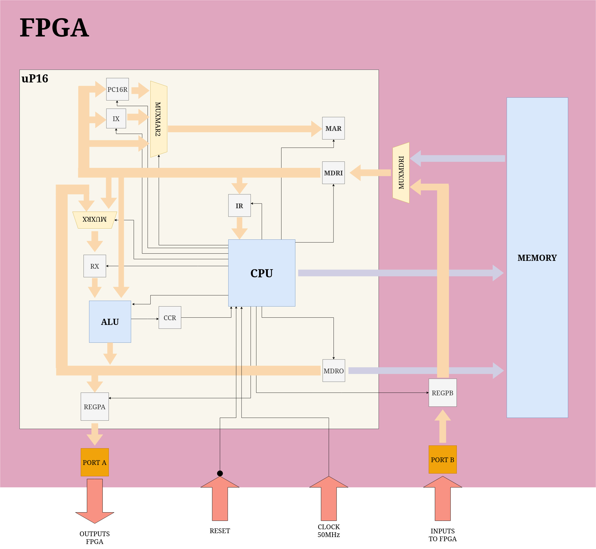

# 16 Bits micro controller

Here lays the description of a 16 bits micro controller in VHDL.

## Table of Contents

- [General Information](#general-information)
- [Technologies Used](#technologies-used)
- [Block diagrams of the design](#blocks-diagrams)
- [Processor instructions](#processor-instructions)

## General Information
    It's a 16 bits micro controller, meaning that the I/O ports (port A and port B) can be controlled bit by bit.
    The port A and B currently are buses of 8 bits.
    The CPU it's based on a states machine.

## Technologies Used

- [FPGA Cyclone IV EP4CE22F17C6](https://ark.intel.com/content/www/us/en/ark/products/210468/cyclone-iv-ep4ce22-fpga.html)
- [Intel® Quartus® II Web Edition Design Software Version 13.1](https://www.intel.com/content/www/us/en/software-kit/666221/intel-quartus-ii-web-edition-design-software-version-13-1-for-windows.html)

## Blocks diagrams

## Processor Instructions
| Description           | Pseudo name | HEX     | BINARY
| :-------------------- | :---------: | :-----: | -----:
| clears register RX    | CLR_RX      | 0000    | 0000000000000000
| increments by 1 RX    | INC_RX      | 0100    | 0000000100000000
| loads RX with a number of 8 bits in the 8 LSB of the instruction  | INC_RX      | 01XX    | 00000001XXXXXXXX
| decrements by 1 RX    | DEC_RX      | 0300    | 0000001100000000

## Contact

Created by [@TomiVidal99](https://www.tomasvidal.xyz/) - feel free to contact me!

## License

This project is open source and available under the [MIT License](../LICENSE).
